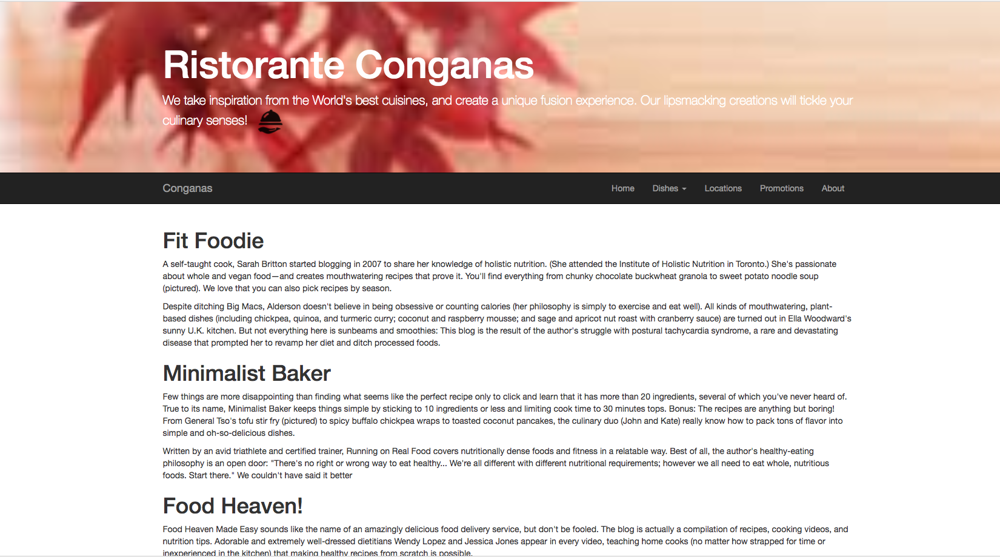

# nodexpress

nodexpress application w/rest api route support
> exclude: REST_API_Route_Support_App, airline, flight, mongoCRUD

+ got 3 REST route/endpoints and 1 static page(about)
	- all links working
	- each one has: endpoint/:endpointID
	- tested w/postman
+ adding bootstrap

<kbd>in-progress</kbd>

<kbd>in-progress</kbd>

