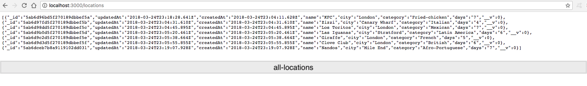
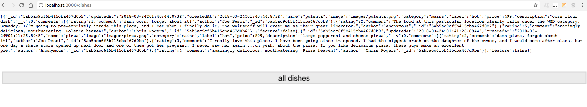
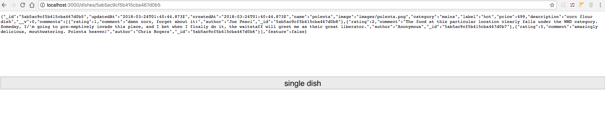
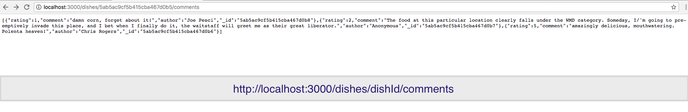

## nodexpress app

Current working directory => mserver        
How-to:
+ cd to mserver
+ install dependencies
+ `mongod` starts database, & `mongo` to access database
+ run `npm start` to start server in localhost:3000

Other:
+ main access point is `app.js` (package.json) & `mserver` is root dir for this application
+ mongoose debug mode set to true atm

- [app.js] express server
- [routes folder] rest routes
- [public folder] static dir
- [routes/dishRouter] configured dish router endpoints
- [routes/locationRouter] configured location router endpoints
- [routes/promoRouter] configured promo router endpoints
- [views folder] configured dishes,locations,promotions with EJS templating engine
- [views/partials] includes for header,footer and links 
- [public/about] added about static page
- [models/dishes] configured dishes schema model
- [mongodb:27017/testa/dishes] ran some dishes json data w/postman
- [models/locations] configured locations.js mongoose schema model
- [mongodb:27017/testa/locations] added some locations json data w/postman to mongodb
- [public/js] json files at public/js
- [models/promotions] configured promotions schema model
- [mongodb:27017/testa/promotions] ran some promotions json data w/postman
- [mongodb:27017/testa/dishes/:dishId/comments] configured subdocs comments
- [mongodb:27017/testa/dishes/:dishId/comments] ran some comments json data w/postman
- [models/dishes/:dishId/comments] `$pushAll` error when using `POST` to include a new    
  comment. Found `solution` online: by adding `usePushEach:true` as an option to the dish schema.
- [views/dishes] parsed json data & rendered html to dishes with EJS

 

 
<kbd>all locations</kbd>

 

 

 
<kbd>all dishes</kbd>

 

 

 
<kbd>single dish</kbd>

 

 

 

 

 
<kbd>home page</kbd>

 

 

